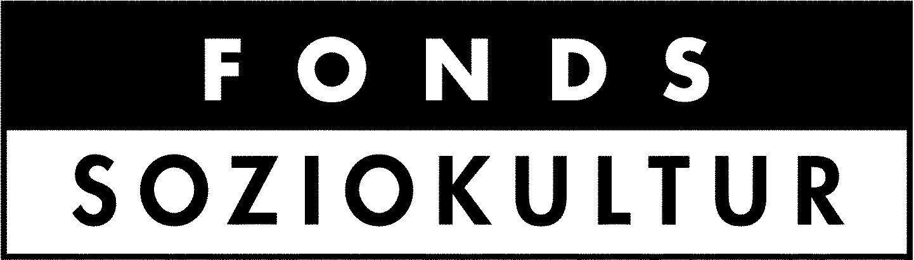

Vielen Dank an unsere Projektpartner\*innen, die uns bei der Umsetzung von Projektideen unterstützen!

## Aktuelle Förderungen

### Fahrradprojekt – Mobilität nachhaltig fördern

Gefördert durch Aktion Mensch.

### Girls\* only Area & Upcycling Holzwerkstatt

Gefördert durch die Deutsche Postcode Lotterie und Fonds Soziokultur.

### Vom selbstverwalteten soziokulturellen Zentrum zum selbstverwalteten soziokulturellen Stadtteilzentrum

Gefördert durch den Fonds Soziokultur aus Mitteln der Beauftragten der Bundesregierung für Kultur und Medien im Rahmen von NEUSTART KULTUR

